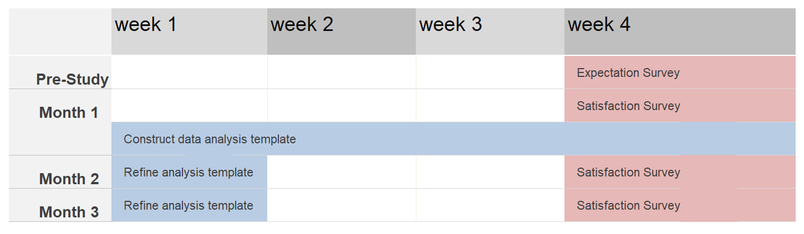

```{r setup, include=FALSE}
knitr::opts_chunk$set(echo = FALSE)
```

<style>
slides > slide.title-slide hgroup h1 {  
  color: black;
  font-size: 30px;
  letter-spacing: 10;
}
</style>

# Scenario

## Background & Problem

* Serious stock traders that take a technical approach can spend a lot of time monitoring indicators for dozens of portfolio assets

* Lack of an adequate alert system may result in the trader being late in seeing an important buy or sell signal 

## Solution 

* I^TRADE releases a new service that gives alerts once a certain market technical indicator reaches a given threshold. 
    * ex: Relative Strength Index (RSI) going above 70 suggests an asset is overbought
    
This saves the customer valuable time and improves use of technical indicators to increase gains, prevent losses, etc.

## Benefits

* Gives I^TRADE customers a trading advantage over other platforms

* Helps technical traders with highly-diversified portfolios to keep track of buy/sell signals

## Example 

1. Customer wants to be alerted when the RSI for any stock in their portfolio passes above 70
2. AAPL hits an RSI of over 70
3. Customer receives email alert with a link to AAPL's stock page
4. Webpage opens with candle chart and time series chart of RSI

## Implementation

1.) Customer enters technical indicator(s) and details or thresholds to be alerted for 
<BR>
<BR>
{width=450px}
 
## Implementation (2)
 
2.) Email is sent with indicator details and a link to a customized webpage for that stock
<BR>
<BR>
{width=450px}

## Implementation (3)

3.) On the linked page, a candlestick chart is displayed with graphs and figures of the corresponding technical indicators below
<BR>
<BR>
{width=450px}

# Design

## Data Collection

* A survey of 10 questions will be provided to each participant before starting and at the end of each month to capture answers to personal and subjective questions
    * helps track changes in interest over time
    * helps with minor month-to-month adjustments
    * provides an idea of how customers value the service in terms of money

## Data Collection (2)

* The first survey will be used as an "expectation" survey
    * Allows us to analyze customer satisfaction similarly to the [Kano model](https://www.mindtools.com/pages/article/newCT_97.htm)

## Data Collection (3)

* The rest of the data will be collected automatically through account data and anonymized
    * i.e. number of stocks in portfolio

## Budget 

The proposed budget was listed as $50,000

```{r, echo=FALSE, warning=FALSE, message=FALSE}
### Make table
a <- c('Participant Incentives',
       'Financial and survey data collection',
       'Analysis, visualizations, and results write-up',
       'Safety net'
)
b <- c('$30,000', '$5,000', '$10,000', '$5,000')

prnt.df <- cbind(a, b)

### Print table
knitr::kable(prnt.df, col.names=NULL)
```

## Time Estimates (overview)

{width=700px,height=500px}

## Time Estimates

* Participants use service for three months
    * gives around 60 data points per participant

* While waiting for month 1's survey data, researchers will set up an adjustable template for visualization and analysis based the data structure and consistency
    * gives management and researchers updates of how the study is going

# Experiment Description

## Full Description (1)

* An email will be sent out to all clients who have not opted out of receiving emails
    * the email will request that they fill out a short form to apply for a position in testing the new service
    * the email will also inform them of relevant details from the experimental outline

* Information from applications will then be verified 

## Full Description (2)

* Participants will use the service for a 3-month experimental period

* A survey of 10 questions will be provided to each participant before starting and at the end of each month to measure subjective views

* The rest of the data, such as number of stocks in a participant's portfolio, will be collected automatically through account data

## Full Description (3)

* During the first month of the study, researchers will design a template to graph and analyze the data based on the data structure and consistency

* At the end of the experimental period, data will be visualized, analyzed, and presented.

